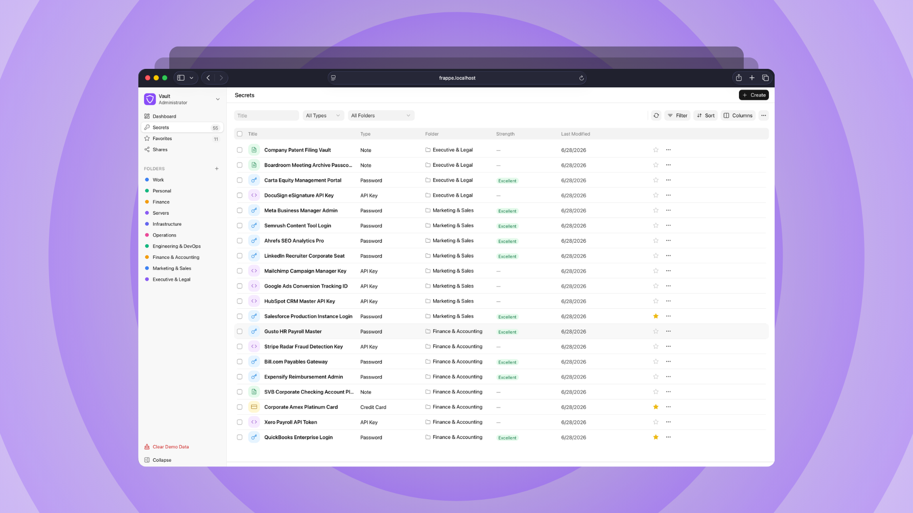

<p align="center"></p>




# Frappe Vault

Secrets and password management application. Securely store, share, and manage sensitive credentials within your Frappe/ERPNext portal.

## Features

- **Secure Storage**: Store passwords, API keys, SSH keys, certificates, and notes with encryption
- **Folders**: Organize secrets in a tree-based folder structure
- **Access Logging**: Track who accessed which secrets and when
- **Sharing**: Share secrets with specific users or roles
- **Favorites**: Mark frequently used secrets as favorites
- **Dashboard**: Visual overview with statistics and charts
- **REST API**: Full API access for browser extensions and integrations

## Installation

### Prerequisites

- Frappe Framework v15+
- An active Frappe/ERPNext site

### Install via Bench

```bash
# Get the app
bench get-app https://github.com/lubusIN/frappe-vault.git

# Install on your site
bench --site your-site.local install-app frappe_vault
```

### Development Installation

```bash
# Clone the repository
cd ~/frappe-bench/apps
git clone https://github.com/lubusIN/frappe-vault.git

# Install the app
bench --site your-site.local install-app frappe_vault

# Enable developer mode (optional, for development)
bench --site your-site.local set-config developer_mode 1
```

## Configuration

### Encryption Key

Frappe Vault uses Frappe's built-in encryption which relies on the site's encryption key. This is automatically configured when you set up your Frappe site.

To verify your encryption key is set:

```bash
bench --site your-site.local console
>>> from frappe.utils.password import get_encryption_key
>>> bool(get_encryption_key())  # Should return True
```

If you need to set an encryption key manually:

```bash
bench --site your-site.local set-config encryption_key "your-secure-32-byte-key-here"
```

**Important**: Keep your encryption key secure and backed up. Losing it means losing access to all encrypted secrets.

### Roles and Permissions

Frappe Vault creates two custom roles on installation:

- **Vault User**: Can create, read, and update their own secrets
- **Vault Manager**: Full access to all vault operations including access logs

Assign these roles to users through the User DocType or Role Permissions Manager.

## Usage

### Creating Secrets

1. Navigate to **Frappe Vault > Vault Secret > New**
2. Enter a title and select the secret type
3. Fill in the credentials (password, API key, etc.)
4. Optionally assign a folder and tags
5. Save

### Sharing Secrets

1. Open a secret
2. Go to the **Sharing** section
3. Add users or roles with read/write permissions
4. Set an optional expiration date

### REST API

All secrets are accessible via REST API for integration with other applications.

```bash
# Get all secrets
curl -X GET "https://your-site.local/api/method/frappe-vault.api.get_secrets" \
  -H "Authorization: token api_key:api_secret"

# Get a specific secret with decrypted password
curl -X GET "https://your-site.local/api/method/frappe-vault.api.get_secret" \
  -H "Authorization: token api_key:api_secret" \
  -d "name=VS-0001"

# Create a new secret
curl -X POST "https://your-site.local/api/method/frappe-vault.api.create_secret" \
  -H "Authorization: token api_key:api_secret" \
  -d "title=My Secret&secret_type=Password&password=hunter2"

# Generate a password
curl -X GET "https://your-site.local/api/method/frappe-vault.api.generate_password" \
  -H "Authorization: token api_key:api_secret" \
  -d "length=20&use_special=1"
```

## DocTypes

### Vault Secret

Main document for storing credentials.

| Field | Type | Description |
|-------|------|-------------|
| title | Data | Name/title of the secret |
| secret_type | Select | Password, API Key, Note, SSH Key, Certificate, Other |
| folder | Link | Reference to Vault Folder |
| url | Data | Associated website/service URL |
| username | Data | Username for the credential |
| password | Password | Encrypted password field |
| api_key | Data | API key (for API Key type) |
| api_secret | Password | Encrypted API secret |
| notes | Text Editor | Additional notes |
| is_favorite | Check | Mark as favorite |
| password_strength | Select | Calculated password strength |

### Vault Folder

Tree-based organization for secrets.

### Vault Access Log

Read-only audit log tracking all secret access.

## Security

- All passwords and secrets are encrypted using Frappe's built-in AES encryption
- Encryption relies on the site's encryption key stored in `site_config.json`
- Role-based access control (RBAC) using Frappe's Permission Manager
- Access logging for audit compliance
- Secrets are only accessible by owners or explicitly shared users/roles

## Contributing

Contributions are welcome! Please feel free to submit a Pull Request.

## Support

For issues and feature requests, please use the GitHub issue tracker.

## Meet Your Artisans

[LUBUS](https://lubus.in/?utm_source=github&utm_medium=open-source&utm_campaign=frappe-vault) is a web design agency based in Mumbai.

<a href="https://cal.com/lubus">

</a>

## License

Frappe Local is open-sourced licensed under the [MIT License](LICENSE).